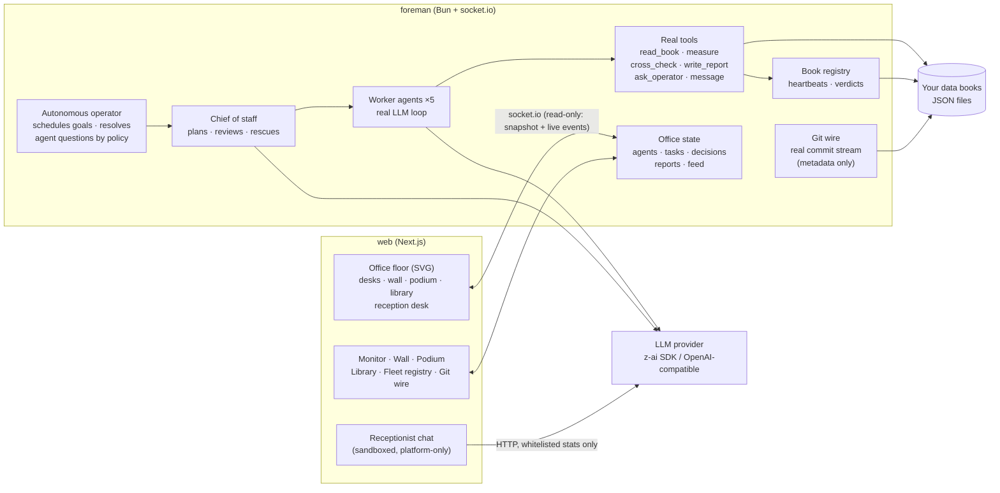

# Fleet HQ — a live operations room for real AI agents

**מפקדת הצי** — a live office where a crew of AI agents plans, works and reports on **your real data books**, and you watch every step happen.

Not a wall of terminal text. Not a fake dashboard. A place.

---

<div align="center">

| | |
|---|---|
| 🧭 **The chief of staff** | The **autonomous operator** schedules goals. The lead agent reads them, splits them into real tasks with dependencies and pins them to the **Task Wall**. |
| 🛠 **The crew works** | Five worker agents walk to their desks and execute: they read your data books, measure values, cross-check books against each other — every tool call streams live on their **desk monitors**. |
| 🗣 **They talk** | Speech bubbles, messages to each other, honest activity lines under every nameplate. |
| 🙋 **They resolve themselves** | When a judgment call is needed, the agent walks to the **Decision Podium** — and the operator's own policy resolves it in seconds. The podium is a public transparency record, not a control surface. |
| 📚 **Work lands in the Library** | Real reports written by the agents — grounded only in data they actually read. |
| 📡 **The Git Wire** | The office wall displays the **real commit stream** of the books repo — actual timestamps and subjects, metadata only. |

**Fully autonomous.** The public office is a *window, not a steering wheel*: there is no goal console, no decision answering, no write path — nothing a visitor can steer. The operator schedules the work; the crew deliberates and resolves its own questions by policy.

</div>

---

## Why it's different

Most "agent dashboards" show a spinner and a status word. Fleet HQ shows **the work itself**:

- **Live monitors on every desk** stream each agent's real log: tool calls, measured values, cross-check results, errors.
- **A real task wall** (kanban: planned → in work → in review → done) driven by the lead's actual plan for your goal.
- **A decision podium** — agents surface judgment calls; the operator's policy resolves them and the reasoning is published right there.
- **A library** that accumulates the crew's real written reports.
- **The honesty law**: agents may only report what they actually read. Every number on screen comes from a real file in your data directory — never invented, never mocked. When something fails, it shows as a failure.

## The two modes

| Mode | What runs | What you need |
|---|---|---|
| **Demo** (`sim`) | A scripted, clearly-labeled simulated crew performing a full scenario on bundled synthetic books (`foreman/demo-data/`). A `DEMO · SIMULATION` watermark is shown at all times. | Nothing. Zero keys, zero config. |
| **Live** (`live`) | Real LLM agents (chief of staff + 5 workers) with real tools operating on your real data books. | An LLM key (see below) + a directory of JSON "books". |

The UI always tells you which mode you are in. The demo exists so anyone can feel the product in 30 seconds — and so public checkouts never ship anyone's real data.

## Quick start

You need [Bun](https://bun.sh) (foreman) and Node 20+ (web).

```sh
# terminal 1 — the foreman (demo crew, no keys needed)
cd foreman
bun install
bun run dev                     # listens on :3010

# terminal 2 — the office
cd web
npm install
npm run dev                     # listens on :3000
```

Open **http://localhost:3000** — you'll see the office with the simulated crew. Watch the whole loop unfold on its own: plan → wall → desks → decisions → library. Click the receptionist at the front desk — he answers questions about the platform (and nothing else).

> Behind a reverse proxy? The web client connects to `/?XTransformPort=3010` on the same origin (path `/`). Keep that contract or adjust `AgentHQ.tsx`.

## Going live

1. **Books.** Point the foreman at a directory of JSON files (fleet state, ledgers, audits, registries — your domain's "books"). Either create `foreman/data/` or export `AGENT_HQ_DATA_DIR=/path/to/your/books`.

   Book expectations are light: any JSON file with an optional date-ish field (`at`, `asOf`, `generatedAt`, …) gets a heartbeat; optional `ok` / `verdict` top-level fields are surfaced. See `foreman/src/books.ts` for the built-in registry (edit `BOOK_DEFS` to match your domain).

2. **LLM.** The foreman auto-detects, in order:
   - `z-ai-web-dev-sdk` if it is installed next to the foreman,
   - any OpenAI-compatible endpoint via `OPENAI_API_KEY` (+ optional `OPENAI_BASE_URL`, `OPENAI_MODEL`).
   - Nothing found → the office stays in the labeled demo mode. It never fakes "live".

3. **Run.** Restart the foreman — the header badge flips to **Live crew · real model agents**. The autonomous operator schedules the patrol; the crew works the books and you watch it happen in real time.

```sh
# example
OPENAI_API_KEY=sk-... AGENT_HQ_DATA_DIR=$HOME/my-books bun run dev
```

## Architecture



**Task matching (LLM fit reasons).** Every task lands with the *right* worker, and you can see why: the planning model assigns each task a one-line fit reason (`why`), shown on the wall card with an `LLM` badge. If the model is saturated, a deterministic specialty scorer takes over (`FIT` badge) — it scores each worker's specialty vocabulary and owned books against the task text, and the office keeps running an honest, measured routine instead of freezing. The autonomous operator even uses the model to *pick which routine patrol is most valuable right now* from the real freshness table (rotation is the fallback).

**The agent loop.** Every step is a real model call returning strict JSON: `{say?, thought?, tool?, args?, done?, result?}`. The foreman executes the tool *for real*, appends the result to the agent's transcript, and loops until the agent is done (max steps + timeout enforced). Workers may `ask_operator` — the office deliberates ~7 seconds and resolves the question **by policy** (safe default, recorded transparently at the podium). The lead reviews finished tasks (approve / redo once), rescues blocked work by reassigning it, and writes the final operation summary into the library.

## Wire surface (socket.io, path `/`)

Client → server (read-only): `hello(auto)`, `snapshot:request`, `book:preview {id}`, `books:refresh`. **There are no control events** — goals are scheduled by the operator, decisions resolve by policy; unknown events are simply never handled.
Server → client: `snapshot`, then granular `agent` / `log` / `task` / `decision` / `report` / `feed` / `goal` / `books` / `status` / `bubble` / `git` upserts.

## The receptionist (public chat, sandboxed by construction)

The front desk of the office has a person — **עמית / Amit**, the office representative. Click him and a conversation opens. His constraints are structural, not prompt-hopeful:

- The API route (`web/src/app/api/visitor-chat/route.ts`) touches **no filesystem, no database, no socket** — it sends the model one fixed platform-knowledge prompt plus whitelisted numeric counters.
- Visitor messages are treated as **untrusted data** (injection-hardened system prompt, control-character sanitization, 600-char cap).
- Rate limited per-IP (8 msgs / 3 min) and globally, with timeouts, retries, a circuit breaker, and honest degradation messages. He cannot claim to control anything — because he cannot.

## Safety & privacy

- **Keys stay in your environment.** None are read from files, logged, or shipped. See `.env.example`.
- **The public repo contains only synthetic demo data.** Your `data/` directory is yours; keep it out of git (`.gitignore` already does).
- **Agents are read-mostly by design.** The built-in tools read books, measure, cross-check, and write reports *into the in-memory library* (persisted reports are opt-in work — see `office.ts#addReport`). There is no shell, no network, no filesystem-write tool. Extend carefully.
- **No public control surfaces.** The UI, the socket protocol and the HTTP API expose nothing that changes office state. See [SECURITY.md](SECURITY.md) for the full record.

## Cast

| Agent | Role | Owns |
|---|---|---|
| **אלוף / Aluf** | Chief of staff | planning, review, rescue |
| **גל / Gal** | Market operator | exchange & fills books |
| **ארז / Erez** | Internal auditor | audits & capability matrix |
| **תמר / Tamar** | Fleet economist | economics & sovereignty books |
| **שחר / Shachar** | Intelligence officer | indicators, census, learning |
| **ירדן / Yarden** | Infrastructure engineer | registry, schedulers, coord bus |

Each crew member has a distinct silhouette (cap, beanie, bun, hood, headphones) and color — the same desk always belongs to the same operator, and every nameplate carries the agent's live activity line.

## License

MIT — see [LICENSE](LICENSE).
